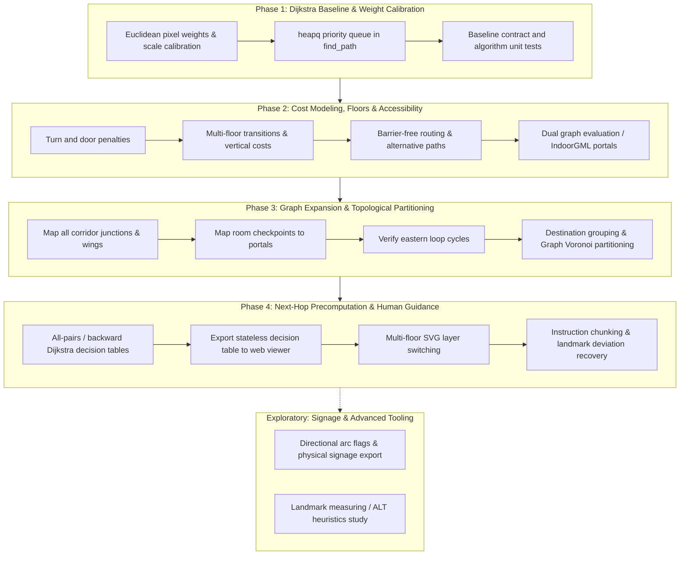

# Roadmap

State: 2026-09-10

## Execution & Tracking

To coordinate implementation between contributors without documentation drift or Git conflicts:

- **Macro View (GitHub Milestones)**: Each major phase corresponds 1:1 to a container GitHub Milestone, tracked as high-level checkboxes in [README.md](README.md).
- **Micro View (GitHub Issues)**: Specific technical bullet points under each phase serve directly as actionable GitHub Issues assigned to individual contributors.

## Overview

The facility layout is characterized primarily by a star topology radiating from central junctions (such as Empfang and `knoten_4`), with cycle structures concentrated in the eastern section. Because full build-out is relatively compact (~200–300 nodes), runtime latency is practically negligible (<1 ms across candidate algorithms). Strategic focus centers on accurate walking cost models, human-oriented instruction clarity, robust handling of loops and deviation, and maintaining clean architectural boundaries between data compilation and static presentation.

The development trajectory moves from an initial unweighted baseline toward weighted routing, multi-floor cost modeling, and precomputed decision tables, with architectural room for specialized traversal graphs and signage generation:

## Phases

### Phase 1: Dijkstra Baseline & Weight Calibration

Transition from unweighted hop counts to physical distance minimization while keeping the web export schema stable.

- Distance calculation: measure Euclidean pixel distances with `math.hypot(x2 - x1, y2 - y1)` across connected coordinates in [src/main.py](src/main.py).
- Scale calibration: introduce an optional pixel-to-meter scaling factor (for example, ~10 px/m) to align distance metrics with discrete physical penalties.
- Priority queue: replace `collections.deque` with `heapq` in `find_path()` to explore lowest-cost paths first.
- Reference preservation: keep unweighted BFS available or documented as an algorithmic regression baseline for test comparisons.
- Contract stability: retain identical export keys (`start`, `points`, `destinations`, `routes`) in `compile_routing_data()` so [web/](web) requires zero adjustments.
- Test verification: update `PathfindingAlgorithmTests` in [src/test_main.py](src/test_main.py) to assert cost-optimal paths.

### Phase 2: Cost Modeling, Multi-Floor Movement & Accessibility

Account for human walking effort, vertical transitions, and facility accessibility requirements.

- Walking cost penalties: penalize directional turns (+5), door passage (+10), and vertical transitions (+20 to +30) per [docs/ignore/wegweiser-design.md](docs/ignore/wegweiser-design.md), ensuring long straight halls naturally beat fragmented routes.
- Multi-floor topology: assign floor metadata (`floor: 0`, `floor: 1`) to nodes and checkpoints; model stairs and elevator shafts with discrete transfer costs rather than geometric distances.
- Accessibility and alternative routing: support barrier-free / step-free path preferences (essential for wheelchair users in a rehabilitation center) via edge filtering or alternative path exploration (such as Yen's k-shortest paths).
- Graph representation choice: evaluate conventional node-edge placement versus an inverted dual graph (portals as nodes, zone crossings as edges, aligned with the IndoorGML node-relation standard), which simplifies directional turn costs.
- Contract extension: enrich exported metadata with floor indicators to enable multi-level rendering.

### Phase 3: Graph Expansion & Topological Partitioning

Scale data coverage from the prototype subset to the complete facility layout (~200–300 rooms).

- Wing and corridor mapping: systematically digitize portals and junctions across the five radial wings (North, North-West, West, South, and the looped Eastern block).
- Loop verification: confirm that cycles in the eastern section resolve to optimal paths without infinite traversal or unnatural detours.
- Room-to-portal connections: link room checkpoints to corridor access points, connecting each room to relevant zone portals to prevent missed bypasses.
- Destination grouping & Voronoi partitioning: explore clustering destinations by wing, zone, or department (such as Graph Voronoi cells where portals claim surrounding target territories), keeping suggestion lists manageable and structuring navigation hierarchy.

### Phase 4: Next-Hop Precomputation & Human-Oriented Guidance

Shift from single-origin kiosk computations to precomputed signpost tables and structured instructions.

- Precomputed decision tables: run backward or all-pairs Dijkstra during compilation to produce a stateless next-hop matrix (`next_portal = routing[current_portal][destination]`).
- Replay-based route generation: generate routes as a sequence of discrete portal transitions rather than rigid static path strings.
- Deviation and recovery: leverage named portals (stairwells, elevators, central junctions) so lost users can self-localize and receive immediate rerouting from any current landmark without full graph recalculations.
- Instruction chunking: collapse granular segment chains into memorable human instructions ("follow main corridor to Knoten 4, take stairs to 1st floor, third door on left").
- Multi-floor presentation: implement dynamic SVG layer switching in [web/](web) to display active floor plans as routes traverse levels.

### Exploratory Horizons: Signage Synthesis & Advanced Tooling

Open-ended possibilities for operational tooling and architectural extensions beyond core routing.

- Directional signage export: utilize directional portal tags and arc flags to auto-generate physical signage schedules (e.g. printable lists of which destinations should appear on signs at each junction).
- Dynamic cost adjustments: explore lightweight cache invalidation strategies for facility events (such as temporary elevator outages or wing closures during maintenance).
- Advanced spatial heuristics: maintain landmark-based heuristics (such as ALT—A*, Landmarks, Triangle inequality) or hierarchical abstractions (HPA*) as architectural references for multi-building or campus-scale expansion.
